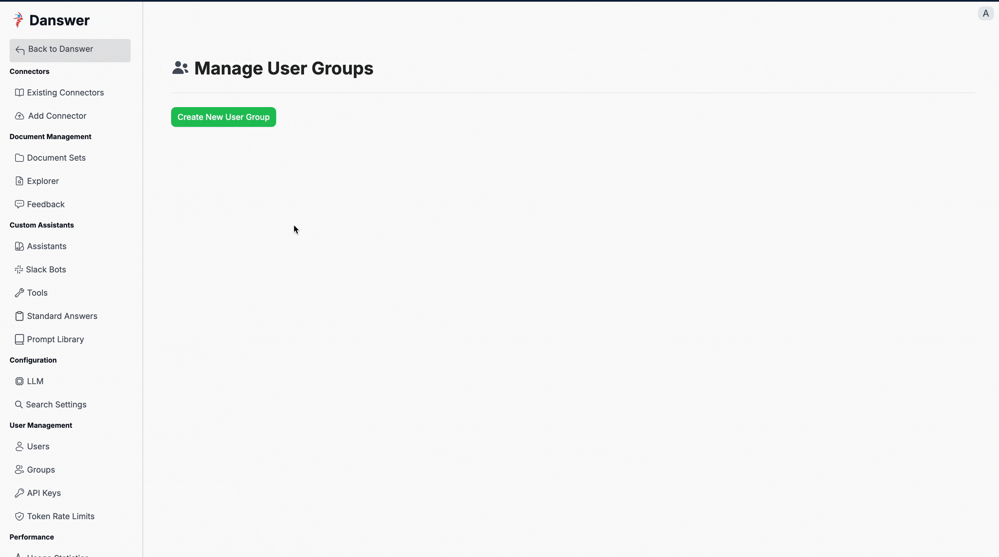
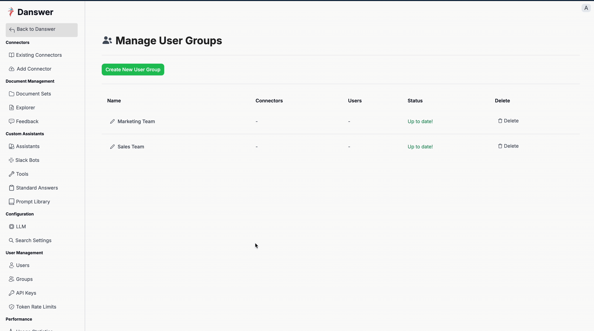
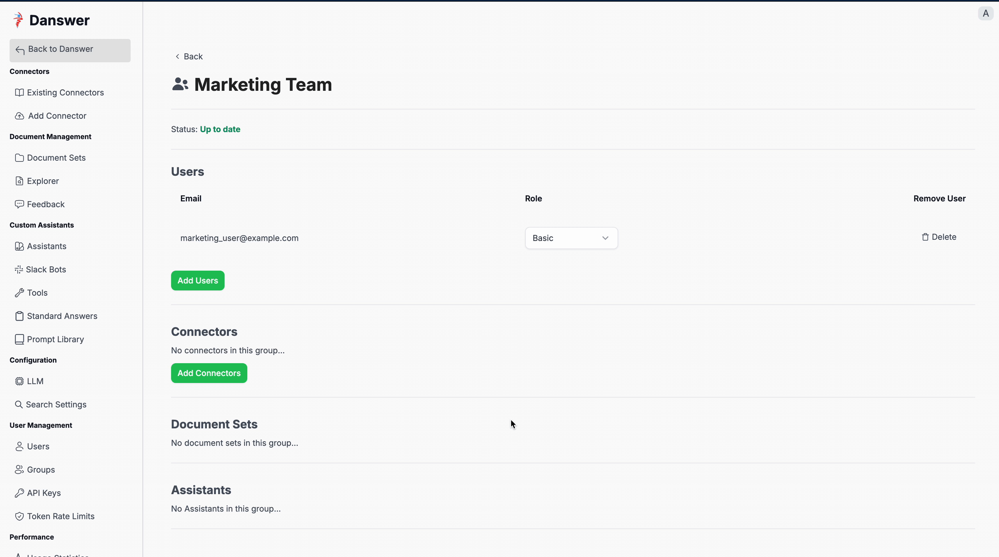
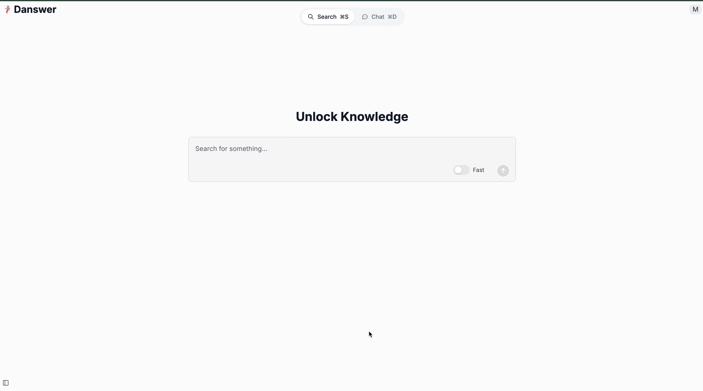

The goal here is to walk through a simple example of why and how an admin would set up Curators.

## Curator Setup Example

### Scenario

You are a Onyx admin for a company with a **Sales Team** and a **Marketing Team**. You want the teams to have access to the data they need to do their jobs, but you don't want them to have access to each other's data.

However, creating the groups, creating all the connectors, document sets, etc. for each group and then assigning the relevant users to each group may require significant and ongoing effort.

Appointing an admin for each group _would_ give them access to the data they need, but then those users would be able to access/share all data in the Onyx instance (which is not ideal).

Instead of that, you can appoint a Curator(s) for each group, who will be able to create the connectors, document sets, etc. for that group.

### Steps:

1. Create a group for the marketing team and a group for the sales team:
   

2. Add the user(s) you would like to be Curators for each group:
   

3. Change their role in the group to Curator:
   

4. The Curators can now manage their groups by inviting users, creating connectors, building document sets, and more (Curator POV):
   
